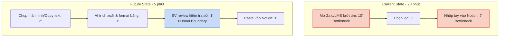

# 01 — Individual Problem Scan

> Điền theo Phase 1 + Phase 2 trong `01-worksheet.md`. Tự scan trước, dùng AI sau để phản biện. Không copy ví dụ Weekly Report.

## Thông tin cá nhân

- Họ và tên: Nguỵ Quang Hùng
- Mã học viên: 2A202602998
- Vai trò / bối cảnh: Sinh viên năm 4 ngành Công nghệ thông tin
- Công việc hằng tuần:
  - Tham gia học tập trên trường, làm đồ án tốt nghiệp, làm bài tập cá nhân/nhóm.
  - Code project cá nhân / bài tập lớn, debug và setup môi trường.
  - Lên kế hoạch, sắp xếp công việc, chuẩn bị phỏng vấn/thực tập, gửi CV.
  - Kiểm thử (QA/Testing) cho đồ án nhóm (viết test case, test API, log bug).

---

## Phase 1 — Scan 5+ problems (tối thiểu 5, khuyến khích 8-10)

| # | Lăng kính | Problem quan sát được | Ai chịu ảnh hưởng? | Dấu hiệu thật (số + bằng chứng) |
|---|---|---|---|---|
| 1 | Tốn thời gian | Tìm kiếm nguyên nhân lỗi (debug) thông qua việc đọc log dài dằng dặc mỗi khi chạy server backend bị lỗi. | Sinh viên IT | Mất 30-60 phút/lần tìm bug, đọc StackOverflow và thử sai (2-3 lần/tuần). |
| 2 | Lặp lại | Viết và thực hiện các Unit test, Test case lặp đi lặp lại nhiều trường hợp biên từ requirement của môn học. | Sinh viên làm nhóm/QA | Mất 1.5 - 2 tiếng/module để bao phủ test case, hay bỏ sót edge cases. |
| 3 | Lặp lại | Setup lại môi trường từ đầu (cài DB, config env, init thư viện) cho mỗi project/môn học mới. | Sinh viên IT | Mất nguyên 1 buổi (3-4 tiếng) chỉ để môi trường chạy được Hello World đầu kỳ. |
| 4 | Pain từ người khác | Bạn cùng nhóm viết API nhưng không có document/comment, phải chờ hỏi trực tiếp để biết cách gọi và truyền tham số. | Thành viên làm chung đồ án | Chờ 30-60 phút để nhận phản hồi từ bạn, lặp lại 3-4 lần/tuần. |
| 5 | Tốn thời gian | Đọc API Reference/documentation của thư viện mới (ví dụ React, thư viện vẽ biểu đồ) để tìm đúng hàm cần xài. | Sinh viên IT | Tốn 2-3 tiếng ngụp lặn trong Doc và tutorial YouTube mà chưa làm được chức năng. |
| 6 | AI có thể tốt hơn | Lọc các thông báo deadline, lịch họp rải rác từ Zalo, Messenger, Teams, LMS để note lại vào Notion cá nhân. | Sinh viên đi học | Mất 15-20 phút mỗi đầu tuần, thỉnh thoảng vẫn trôi tin nhắn và quên deadline. |
| 7 | Tốn thời gian | Bị mất context và không biết bắt đầu từ đâu sau khi chuyển đổi qua lại giữa đồ án nhóm, bài tập trên trường và việc cá nhân. | Sinh viên IT | Mất 15 phút ngó màn hình, check lại commit cũ để nhớ mình đang code tới file nào. |
| 8 | Lặp lại | Chỉnh sửa CV, từ khóa, viết lại Cover Letter cho khớp với Job Description của từng công ty muốn nộp thực tập. | Sinh viên năm 4 nộp CV | Mất 30-45 phút mỗi lần chuẩn bị file và nộp cho 1 công ty. |

**AI đã dùng ở Phase 1 (nếu có):**
- Prompt đã hỏi: Từ các công việc hằng ngày của một sinh viên IT năm 4, hãy gợi ý các problems cụ thể tốn thời gian, lặp lại.
- Ý dùng được: Chỉnh sửa CV cho nhiều công ty, Mất context khi làm nhiều môn, Đọc doc thư viện mới.
- Ý bỏ vì không phải pain thật: AI gợi ý "Xây hệ thống tự động học bài", ý này quá viển vông, không phải problem thực tế ở mức workflow.

**Self-check Phase 1:**
- [x] Đủ 5+ dòng, mỗi dòng có actor + số đo cụ thể
- [x] Dùng ít nhất 3/4 lăng kính
- [x] Không có dòng chung chung kiểu "mất nhiều thời gian"

---

## Phase 2 — Top 3 Problem Cards

### 2.1. Chọn top 3

| Rank | Problem (copy từ bảng scan) | Vì sao chọn (2-3 ý) | Điều còn chưa chắc |
|---|---|---|---|
| 1 | Tìm kiếm nguyên nhân lỗi (debug) thông qua việc đọc log dài dằng dặc mỗi khi chạy server backend bị lỗi. | Actor rõ ràng (Dev/SV). Mất thời gian đáng kể. Rất phù hợp để AI đọc log và chỉ ra lỗi chính xác. | Khó biết liệu log có lộ thông tin nhạy cảm (token) khi đưa cho AI không. |
| 2 | Đọc API Reference/documentation của thư viện mới để tìm đúng hàm cần xài. | Cần phải làm thường xuyên trong ngành IT. Việc search keyword truyền thống thường không hiệu quả bằng AI hiểu context. | Doc mới AI có thể chưa update (hallucination). |
| 3 | Lọc các thông báo deadline, lịch họp rải rác từ Zalo, Messenger, Teams, LMS để note lại vào Notion. | Có quy trình lặp đi lặp lại mỗi tuần, bước tổng hợp là bước nghẽn. Có metric rõ ràng. | Dữ liệu nằm ở nhiều nền tảng đóng (Zalo) khó trích xuất tự động. |

### 2.2. Problem Cards chi tiết

---

#### Problem Card #1 — Tìm kiếm và phân tích lỗi (Debug) từ Log

```text
Problem 1 câu: Mỗi khi server/ứng dụng gặp lỗi, sinh viên mất 30-60 phút để đọc đống log dài, tìm từ khóa lỗi và search Google/StackOverflow để tìm ra nguyên nhân và cách fix.

Actor: Sinh viên IT (Dev).

Thời điểm / bối cảnh: Trong quá trình code, chạy thử project cá nhân hoặc đồ án.

Current workflow 3-7 bước:
1. Chạy chương trình và bị crash.
2. Mở terminal, cuộn để đọc hàng trăm dòng stack trace/log.
3. Tìm ra dòng chứa từ khóa lỗi (Exception).
4. Copy từ khóa đó lên Google/StackOverflow tìm kiếm.
5. Đọc các bài viết, thử các cách giải quyết khác nhau.
6. Fix code và chạy lại.

Bottleneck: Bước 2 và 5 (Đọc log dài để tìm lỗi thật sự và thử sai các giải pháp trên mạng) — 30-45 phút.

Impact: Tốn hàng chục tiếng mỗi tháng chỉ để fix lặt vặt. Khiến project đình trệ, nản chí khi học code.

Success metric: Giảm thời gian tìm ra nguyên nhân và cách fix từ 30-60 phút xuống còn 5 phút/lỗi. Giảm tỷ lệ phải thử sai nhiều lần.

Non-AI alternative: Cấu hình logger tốt hơn trong code, gom nhóm lỗi, có doc hướng dẫn xử lý lỗi nội bộ. 

AI hypothesis: Đưa log (kèm file code bị lỗi) cho AI, AI phân tích đúng stack trace, chỉ ra chính xác dòng code gây lỗi và giải thích tại sao lỗi, đề xuất đoạn code sửa.

Quick gut:
[ ] No AI / process fix
[ ] Rule
[x] Workflow
[ ] Agent
[ ] Chưa biết
```

**Draft workflow Card #1:**

```mermaid
graph TD
    subgraph Current State - 45 phút
        direction LR
        A1[Chạy & Crash: 1'] --> A2[Đọc log tìm lỗi: 10']
        A2 --> A3[Search Google: 5']
        A3 --> A4[Đọc & Thử sai: 25'<br/>Bottleneck]
        A4 --> A5[Fix & Test: 4']
        style A4 fill:#f9d0c4,stroke:#e06666,stroke-width:2px
    end

    subgraph Future State - 7 phút
        direction LR
        B1[Chạy & Crash: 1'] --> B2[Copy log + context cho AI: 1']
        B2 --> B3[AI giải thích & đề xuất code: 1']
        B3 --> B4[Dev review & paste code: 3'<br/>Human Boundary]
        B4 --> B5[Test: 1']
        style B4 fill:#c9daf8,stroke:#6d9eeb,stroke-width:2px
    end
```


**Fallback**: Nếu AI hallucinate hoặc fix không chạy, Dev quay lại tự debug bằng Google.

File đính kèm (nếu vẽ riêng): `01-individual-problem-scan-workflow-card-1.png`

---

#### Problem Card #2 — Đọc Doc thư viện mới để tìm hàm

```text
Problem 1 câu: Khi áp dụng thư viện/công nghệ mới cho đồ án, sinh viên tốn 2-3 tiếng ngụp lặn trong Documentation để tìm đúng hàm chức năng thay vì có thể code ngay.

Actor: Sinh viên IT.

Thời điểm / bối cảnh: Bắt đầu phase code một feature mới dùng thư viện chưa từng xài.

Current workflow 3-7 bước:
1. Biết yêu cầu cần làm (ví dụ: vẽ biểu đồ cột có animation).
2. Vào trang chủ Doc của thư viện (ví dụ Chart.js).
3. Search từ khóa trên Doc, đọc hàng loạt trang cấu hình.
4. Tìm ví dụ (example) có chức năng tương đương.
5. Copy ví dụ, sửa lại cho đúng với logic của mình.
6. Chạy thử.

Bottleneck: Bước 3 và 4 (Đọc Doc và tìm ví dụ phù hợp context) — mất 1.5 - 2 tiếng.

Impact: Tiến độ code bị chậm, dễ nản và thường code bẩn (copy paste không hiểu).

Success metric: Giảm thời gian từ lúc có requirement đến lúc ra đoạn code khung từ 2 tiếng xuống còn 15 phút.

Non-AI alternative: Hỏi senior/người đã từng làm, dùng thư viện quen thuộc hơn, xem tutorial YouTube.

AI hypothesis: Mô tả requirement và thư viện cần dùng, AI (có kiến thức cập nhật hoặc dùng RAG đọc doc) sẽ sinh ra đoạn code khung chuẩn xác cùng link doc tham khảo. Sinh viên đọc code, hiểu và apply.

Quick gut:
[ ] No AI / process fix
[ ] Rule
[x] Workflow
[ ] Agent
[ ] Chưa biết
```

**Draft workflow Card #2:**

```mermaid
graph TD
    subgraph Current State - 120 phút
        direction LR
        A1[Nhận requirement: 5'] --> A2[Vào Doc & Search: 30'<br/>Bottleneck]
        A2 --> A3[Tìm & đọc example: 60'<br/>Bottleneck]
        A3 --> A4[Tùy biến code: 20']
        A4 --> A5[Chạy thử: 5']
        style A2 fill:#f9d0c4,stroke:#e06666,stroke-width:2px
        style A3 fill:#f9d0c4,stroke:#e06666,stroke-width:2px
    end

    subgraph Future State - 15 phút
        direction LR
        B1[Nhận requirement: 5'] --> B2[Prompt cho AI: 2']
        B2 --> B3[AI sinh khung code & giải thích: 1']
        B3 --> B4[Dev review & hiểu code: 5'<br/>Human Boundary]
        B4 --> B5[Chạy thử: 2']
        style B4 fill:#c9daf8,stroke:#6d9eeb,stroke-width:2px
    end
```


**Fallback**: AI sinh code xài API cũ (deprecated), Dev phải lấy link AI đưa hoặc tự vào Doc kiểm tra lại version mới.

File đính kèm: `01-individual-problem-scan-workflow-card-2.png`

---

#### Problem Card #3 — Tổng hợp thông báo và nhắc việc

```text
Problem 1 câu: Mỗi đầu tuần, sinh viên phải tự mở 4-5 ứng dụng (Zalo, LMS, Teams, Mail) để đọc và tổng hợp các deadline, lịch họp vào Notion, dẫn đến mất thời gian và thỉnh thoảng sót việc.

Actor: Sinh viên.

Thời điểm / bối cảnh: Sáng thứ Hai hoặc cuối Chủ Nhật hàng tuần.

Current workflow 3-7 bước:
1. Mở Zalo lớp/nhóm đồ án, cuộn tìm tin nhắn ghim/nhắc việc.
2. Mở LMS trường xem bài tập có deadline tuần tới.
3. Mở Teams/Email xem thông báo.
4. Chọn lọc thông tin cần thiết.
5. Gõ tay các task và deadline vào bảng Notion cá nhân.

Bottleneck: Bước 1, 2, 3 (Đi săn lùng thông tin ở nhiều nơi) và 5 (Nhập liệu thủ công) — 20 phút.

Impact: Tốn 20 phút mỗi tuần cho việc admin, rủi ro quên deadline dẫn đến trễ bài, mất điểm.

Success metric: Giảm thời gian tổng hợp từ 20 phút xuống 3 phút. Không sót deadline nào trong kỳ.

Non-AI alternative: Các nhóm thống nhất chỉ dùng 1 nền tảng duy nhất (vd: Discord) có bot nhắc lịch, trường đẩy API deadline vào Google Calendar.

AI hypothesis: Sinh viên chụp ảnh màn hình hoặc copy paste text thô từ các nhóm, AI đọc hiểu ngữ cảnh, trích xuất (Tên task, Ngày giờ) và format sẵn thành bảng CSV để paste thẳng vào Notion.

Quick gut:
[ ] No AI / process fix
[ ] Rule
[x] Workflow
[ ] Agent
[ ] Chưa biết
```

**Draft workflow Card #3:**


**Fallback**: Text lủng củng AI không hiểu được ngày giờ, SV phải tự đọc và điền tay.

File đính kèm: `01-individual-problem-scan-workflow-card-3.png`

---

### 2.3. Card muốn pitch nhất (chuẩn bị 2 phút)

**Card tôi muốn pitch nhất:**

```text
Problem Card #1 — Tìm kiếm và phân tích lỗi (Debug) từ Log
```

**Vì sao (2-3 câu: workflow gì, số đo gì, impact gì):**

```text
Đây là pain-point phổ biến nhất của sinh viên ngành IT, workflow rất rõ ràng (chạy -> lỗi -> đọc log -> search cách sửa). Số liệu là giảm từ 30-45 phút xuống dưới 10 phút. Impact rất lớn vì sinh viên IT debug hàng ngày, nếu có workflow AI tốt sẽ giúp tiết kiệm hàng trăm giờ học tập và giảm stress.
```

**Câu hỏi tôi muốn nhóm challenge (1-2 câu hỏi đúng chỗ yếu):**

```text
- Nếu log có chứa các thông tin biến môi trường/secret key thì sao? Làm sao để sanitize data trước khi đưa cho AI?
- AI thường hay "hallucinate" ra các cấu hình không tồn tại, làm sao để dev có thể verify đoạn code AI đề xuất một cách nhanh nhất trước khi áp dụng?
```

**AI phản biện Card (nếu có):**
- Điểm yếu AI chỉ ra: AI có thể suggest cách fix chạy được ngay nhưng không tối ưu, khiến dev hình thành thói quen copy-paste mà không hiểu core issue.
- Tôi sửa gì: Đưa boundary rõ ràng, trong future workflow dev PHẢI có bước "Review & hiểu code", không chỉ đơn thuần paste code vào. Thêm điều kiện thành công là "Giảm thời gian nhưng không giảm độ hiểu bài".

### Self-check nộp phần 01
- [x] Có 5+ problems + top 3 Cards đủ field
- [x] Mỗi Card có workflow trước/sau + bottleneck + metric + fallback
- [x] Đã chọn 1 card pitch + câu hỏi challenge
